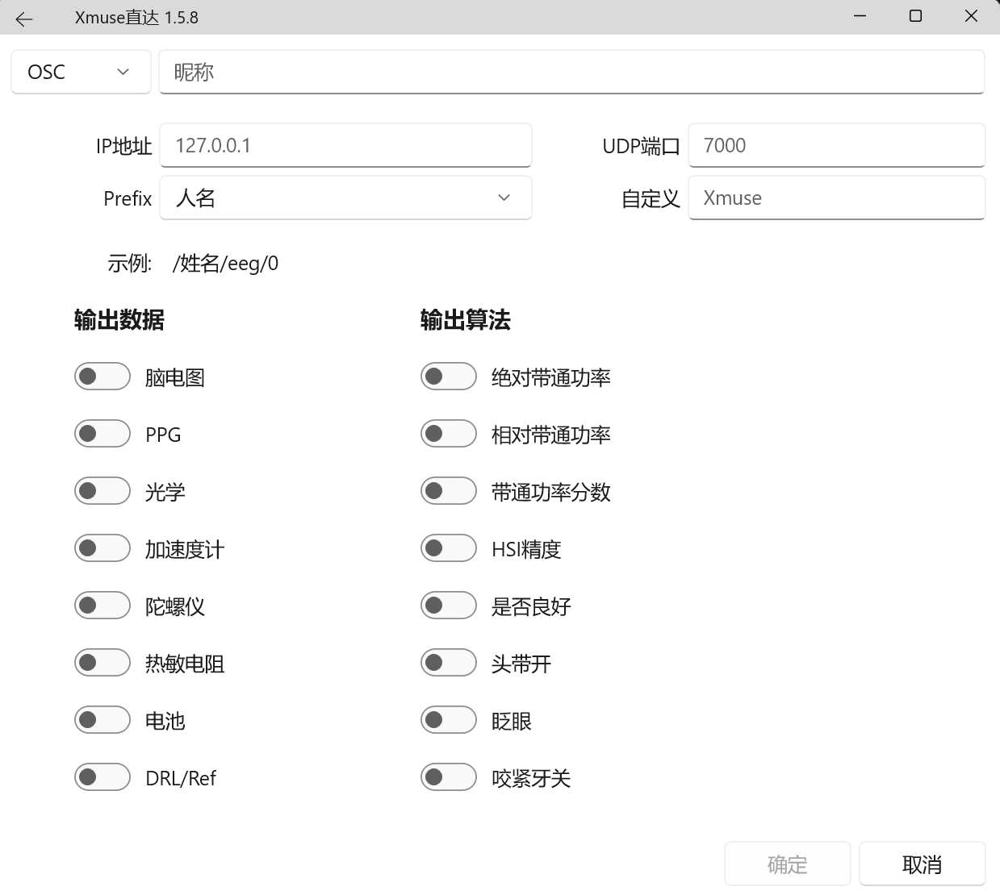
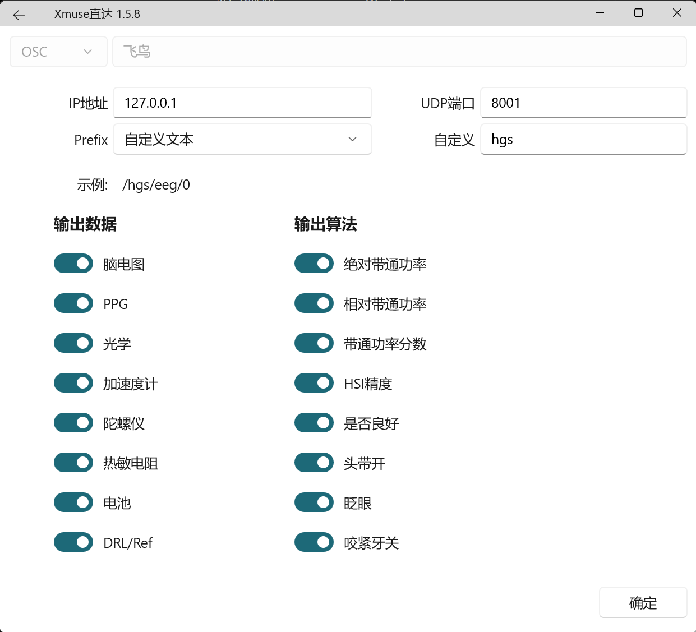
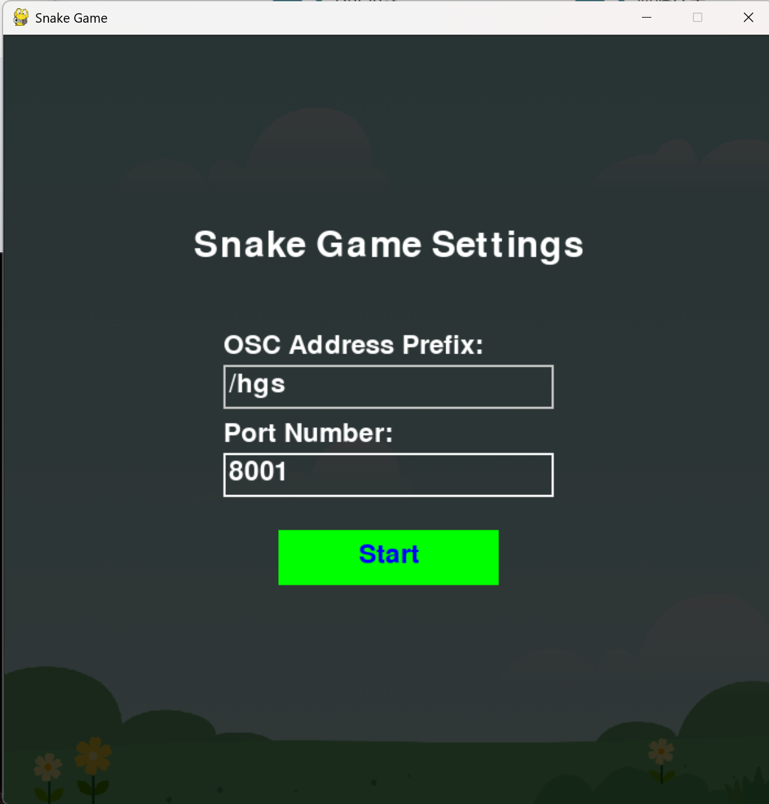
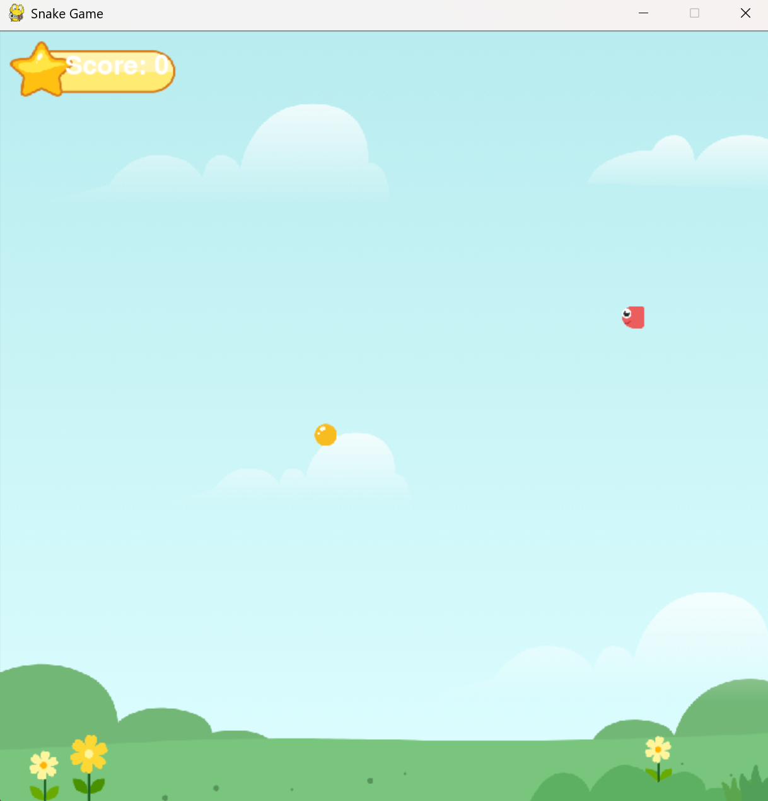
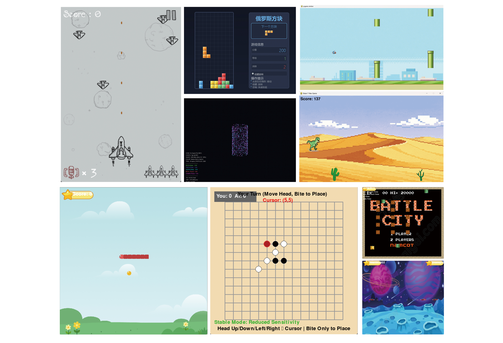

# **Xmuse-Brain-Game**
这是一个基于Xmuse便携式脑电波仪的脑控游戏的仓库，可以用Xmuse的多模态数据进行一系列游戏的互动开发，致力于让脑控游戏成为每一个开发者开箱即玩的趣味仓库。在这里我们不但提供了一些游戏的源码当做一个示例，给开发者进行学习，也提供一些脑控小游戏的demo,抛砖引玉，希望更多的同学可以把自己的作品上传到仓库里，大家一起在娱乐中学习和脑机接口相关的开发内容。
我们也把一些优秀的同学的作品放在本仓库里面进行开源展示和交流学习，希望小伙伴们能给我们的仓库一个Starts。

## 📢配置指南

### 01 Greedy-Snake-Game---Example

简介：一个脑控贪吃蛇小游戏，可以通过Xmuse便携式脑电波仪的多模态数据进行贪吃蛇和果实的控制，具体来说是通过陀螺仪数据实现贪吃蛇上下左右的移动，通过脑电数据中的特征信号控制果实的移动。

1、双击Brain-Snake.exe执行文件，即可开始游戏。

2、游戏前先要进行OSC协议的配置。

3、打开Xmuse Direct进行配置：

以我的配置为例：

4、双击游戏进入输入信号配置页面，并输入相关信息就可以开始游戏了：

## ⚒️游戏Demo

运行仓库里面的exe执行程序，就可以开始控制神奇的大脑进行各种游戏了！

## 🦸‍♂️贡献人员：

① Greedy-Snake-Game    🔊**厦门理工学院    黄阳斌**

② Gomoku-Game    🔊**天津大学福州国际联合学院   吴寿敏**

③ Tank-Game    🔊**天津大学福州国际联合学院    王浩**

④ Space-Battle-Game    🔊**天津大学福州国际联合学院   余睿杰**

⑤ Thunder-Fighter-Game    🔊**天津大学福州国际联合学院  王天潇**

⑥ Brain-Galaxy-Game    🔊**厦门理工学院  佘华烽**

## 🏫合作高校：

## ✉️联系方式

作者：Gion

邮箱：huags@xmuse.cn 、1024@xmuse.cn

##### 🗨️🗨️如有问题或建议，欢迎提交Issue或通过邮件联系。
